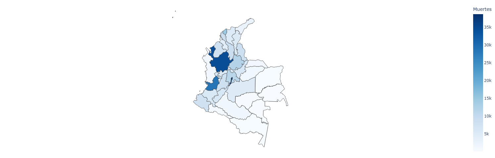
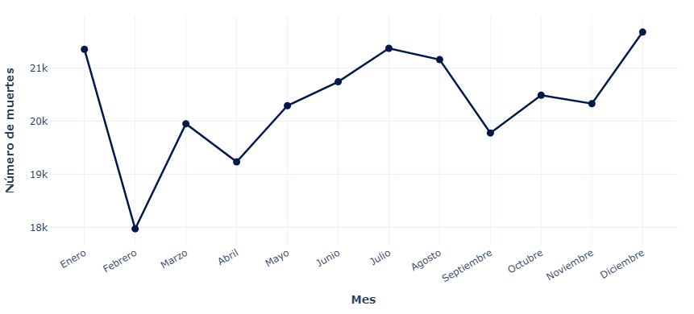
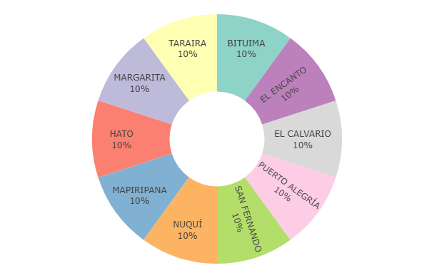
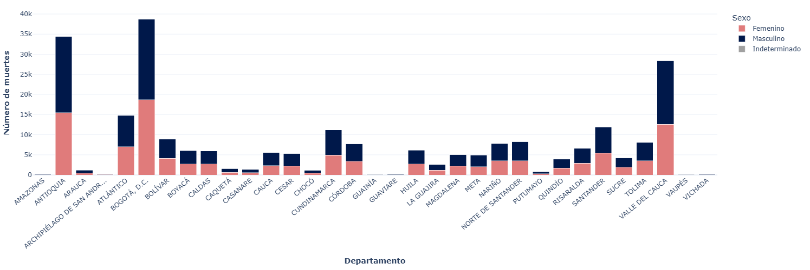
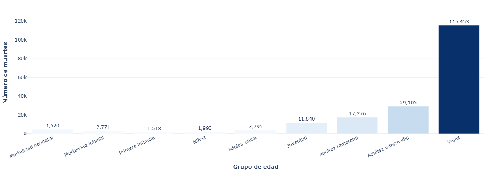
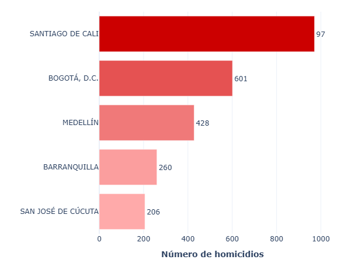
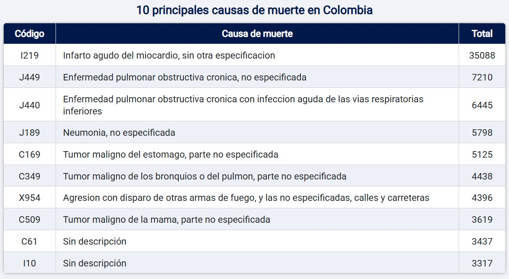

# Aplicación web interactiva para el análisis de mortalidad en Colombia

---


### Maestría en Inteligencia Artificial
### Aplicaciones I

---

#### Presentado por:
Camilo Andrés Castañeda Galindo

#### Repositorio:
[https://github.com/ciaocamilo/M-S1-AP1-Aplicacion-web-analisis](https://github.com/ciaocamilo/M-S1-AP1-Aplicacion-web-analisis)

#### URL Aplicación desplegada:
[https://m-s1-ap1-aplicacion-web-analisis-camilo-c.onrender.com](https://m-s1-ap1-aplicacion-web-analisis-camilo-c.onrender.com/)

---

## Índice

1. [Introducción del proyecto](#1-introducción-del-proyecto)
2. [Objetivo](#2-objetivo)
3. [Estructura del proyecto](#3-estructura-del-proyecto)
4. [Requisitos](#4-requisitos)
5. [Despliegue en Render](#5-despliegue-en-render)
6. [Software](#6-software)
7. [Instalación](#7-instalación)
8. [Visualizaciones y explicación de resultados](#8-visualizaciones-y-explicación-de-resultados)
   - [8.1 Mapa – Distribución de muertes por departamento](#81-mapa--distribución-de-muertes-por-departamento)
   - [8.2 Gráfico de líneas – Total de muertes por mes](#82-gráfico-de-líneas--total-de-muertes-por-mes)
   - [8.3 Gráfico de torta – 10 ciudades con menor mortalidad](#83-gráfico-de-torta--10-ciudades-con-menor-mortalidad)
   - [8.4 Barras apiladas – Muertes por género por departamento](#84-barras-apiladas--muertes-por-género-por-departamento)
   - [8.5 Histograma – Distribución por grupo de edad](#85-histograma--distribución-por-grupo-de-edad)
   - [8.6 Barras horizontales – 5 ciudades más violentas](#86-barras-horizontales--5-ciudades-más-violentas)
   - [8.7 Tabla – 10 principales causas de muerte (CIE-10)](#87-tabla--10-principales-causas-de-muerte-cie-10)

---

## 1. Introducción del proyecto

Esta aplicación web interactiva fue desarrollada con el propósito de explorar y visualizar los datos de mortalidad registrados en Colombia durante el año 2019 con base en los registros oficiales del DANE. Esta información en bruto (xlsx) fue transformada y adaptada a formato csv para su mejor tratamiento. La aplicación está construida con **Dash** (framework de Python sobre Flask) y hace uso de **Plotly** para la generación de gráficos dinámicos, permitiendo filtrar la información según la manera de muerte y obtener distintas perspectivas geográficas, temporales y demográficas de los registros.

---

## 2. Objetivo

Analizar los patrones de mortalidad no fetal en Colombia en 2019 a través de visualizaciones interactivas que permitan identificar:

- La distribución geográfica de las muertes por departamento.
- La variación mensual del número de fallecimientos.
- Las ciudades con menor y mayor índice de mortalidad.
- La distribución por sexo en cada departamento.
- Los grupos de edad más afectados.
- Las principales causas de muerte según la clasificación CIE-10.

---

## 3. Estructura del proyecto

```
M-S1-AP1-Aplicacion-web-analisis/
│
├── inicio.py          # Punto de entrada: asigna el layout y lanza el servidor
├── app.py             # Instancia de la aplicación Dash y configuración base
├── gui.py             # Capa gráfica: definición del layout y figuras estáticas
├── logica.py          # Callbacks de Dash; generadores de figuras dinámicas
├── data.py            # Carga, limpieza y transformación de los datos CSV
│
├── requirements.txt   # Dependencias del proyecto con versiones fijadas
├── README.md          # Documentación del proyecto
│
├── assets/
│   ├── Colombia.geo.json  # GeoJSON de departamentos de Colombia (para el mapa)
│   ├── custom.css         # Estilos personalizados de la aplicación
│   └── favicon.svg        # Ícono de la pestaña del navegador
│
└── data/
    ├── NoFetal2019_CE_15-03-23.csv        # Registros de mortalidad no fetal 2019
    ├── CodigosDeMuerte_CE_15-03-23.csv   # Tabla de códigos CIE-10
    ├── Divipola_CE_ .csv                 # Tabla de municipios y departamentos (DIVIPOLA)
    ├── Grupo_edad.csv                    # Tabla de rangos de edad y categorías
    └── Colombia.geo.json                 # GeoJSON alternativo (copia en data/)
```

---

## 4. Requisitos

Python **3.10+** y las siguientes librerías (versiones exactas en `requirements.txt`):

| Librería | Versión |
|---|---|
| dash | 4.1.0 |
| dash-bootstrap-components | 2.0.4 |
| plotly | 6.7.0 |
| pandas | 3.0.3 |
| numpy | 2.4.5 |
| Flask | 3.1.3 |
| requests | 2.34.2 |

> Las demás dependencias transitivas (Werkzeug, Jinja2, click, etc.) se instalan automáticamente con `pip install -r requirements.txt`.

---

## 5. Despliegue en Render

La aplicación puede desplegarse de forma gratuita en [Render](https://render.com). Los pasos seguidos son:

1. Subir el repositorio a GitHub (o conectar directamente el proyecto).
2. Crear un nuevo servicio de tipo **Web Service** en Render.
3. Configurar los siguientes campos:
   - **Build Command:** `pip install -r requirements.txt`
   - **Start Command:** `python inicio.py`
4. Asegurarse de que `inicio.py` lee la variable de entorno `PORT` para que Render asigne el puerto correcto:
   ```python
   port = int(os.environ.get('PORT', 8050))
   app.run(debug=False, host='0.0.0.0', port=port)
   ```
5. Hacer clic en **Deploy** y esperar a que el build finalice.
6. Acceder a la URL pública que Render asigna al servicio

---

## 6. Software

| Herramienta | Versión / Descripción |
|---|---|
| Python | 3.10 o superior |
| Dash | Framework web para aplicaciones de datos en Python |
| Plotly | Motor de visualizaciones interactivas |
| Pandas | Manipulación y análisis de datos tabulares |
| Dash Bootstrap Components | Componentes de interfaz basados en Bootstrap 5 |
| VS Code | Editor de código utilizado durante el desarrollo |
| Render | Plataforma de despliegue en la nube (PaaS) |
| Git / GitHub | Control de versiones y hospedaje del repositorio |

---

## 7. Instalación

### Clonar el repositorio

```bash
git clone https://github.com/<usuario>/M-S1-AP1-Aplicacion-web-analisis.git
cd M-S1-AP1-Aplicacion-web-analisis
```

### Crear y activar un entorno virtual

```bash
# Windows
python -m venv .venv
.venv\Scripts\activate

# macOS / Linux
python3 -m venv .venv
source .venv/bin/activate
```

### Instalar dependencias

```bash
pip install -r requirements.txt
```

### Ejecutar la aplicación

```bash
python inicio.py
```

Abrir el navegador en `http://localhost:8050`.

---

## 8. Visualizaciones y explicación de resultados

La aplicación cuenta con un **dropdown de filtro adicional** por manera de muerte (Accidente, Homicidio, Enfermedad, Suicidio, etc.) que actualiza simultáneamente todos los gráficos de la sección dinámica.

### 8.1 Mapa – Distribución de muertes por departamento



Mapa de Colombia coloreado en escala de azules según el total de muertes por departamento. Los tonos más oscuros indican mayor concentración de fallecimientos. **Bogotá D.C.** y **Antioquia** encabezan el ranking con las cifras más altas, seguidos por **Valle del Cauca**. La mayor parte del territorio nacional presenta tonalidades claras, lo que evidencia una marcada concentración de la mortalidad en los departamentos más poblados y urbanizados del país.

---

### 8.2 Gráfico de líneas – Total de muertes por mes



Muestra la evolución mensual del número de fallecimientos a lo largo del año 2019. **Febrero** registra el mínimo del año (aproximadamente 18.000 muertes), lo que puede explicarse por ser el mes más corto del calendario. A partir de allí la tendencia es al alza, con un pico pronunciado al final del año donde **Diciembre** alcanza el máximo (aproximadamente 22.000 muertes). El gráfico es interactivo: al filtrar por manera de muerte (p. ej., Homicidio) se puede observar si ciertos meses presentan mayor incidencia de esa causa.

---

### 8.3 Gráfico de torta – 10 ciudades con menor mortalidad



Gráfico de dona que muestra la proporción de muertes en las 10 ciudades con los registros más bajos del país. Cada segmento representa exactamente el **10%** del total, lo que indica que los 10 municipios tienen exactamente el mismo número de defunciones registradas (1 caso por municipio). Algunos municipios identificados son: **Taraira, Bituima, El Encanto, El Calvario, Puerto Alegría, San Fernando, Nuquí, Mapiripana, Hato y Margarita**. Se trata en su mayoría de municipios rurales, alejados y con baja densidad poblacional, lo que explica la mínima cantidad de registros en el sistema de estadísticas vitales. Cabe aclarar que estos datos pueden ser inexactos ya que no se cuenta con la información completa basada en la población total de cada municipio y su proporción a la tasa de mortalidad.

---

### 8.4 Barras apiladas – Muertes por género por departamento



Barras apiladas por departamento diferenciando **Masculino** (azul oscuro), **Femenino** (rojo claro) e **Indeterminado** (gris). **Bogotá D.C.** lidera con aproximadamente 38.000 muertes totales, seguida de **Antioquia** (~34.000) y **Valle del Cauca** (~28.000). La predominancia del azul en todos los departamentos confirma que los hombres representan la mayor proporción de fallecimientos. Esta brecha es especialmente marcada en departamentos con alta incidencia de causas externas como homicidios y accidentes de tránsito.

---

### 8.5 Histograma – Distribución por grupo de edad



Barras que cubren las categorías de edad desde Mortalidad neonatal hasta Vejez, con los valores exactos visibles sobre cada barra. La categoría **Vejez** concentra la inmensa mayoría de las muertes con **115.453 casos**, seguida por **Adultez intermedia** (29.105) y **Adultez temprana** (17.276). En el extremo opuesto, **Primera infancia** presenta el menor registro (1.518 casos). La distribución evidencia que la mortalidad en Colombia en 2019 está dominada por enfermedades crónicas y degenerativas propias del envejecimiento.

---

### 8.6 Barras horizontales – 5 ciudades más violentas



Gráfico de barras horizontales con escala de color de rojo claro a rojo intenso que muestra los 5 municipios con mayor número de homicidios en 2019. **Santiago de Cali** encabeza la lista con **970 homicidios**, seguida de **Bogotá D.C.** (601), **Medellín** (428), **Barranquilla** (260) y **San José de Cúcuta** (206). La concentración en estas cinco ciudades refleja los focos de violencia urbana del país, asociados principalmente al crimen organizado, microtráfico y conflicto armado en contextos urbanos.

---

### 8.7 Tabla – 10 principales causas de muerte (CIE-10)



Tabla interactiva con código CIE-10, descripción de la causa y total de casos. El **Infarto agudo del miocardio (I219)** es la principal causa de muerte con **35.088 casos**, seguida de **EPOC no especificada (J449)** con 7.210 y **EPOC con infección (J440)** con 6.445. También figuran **Neumonía no especificada** (5.798), tumores malignos de estómago (5.125), bronquios y pulmón (4.438) y mama (3.619), así como **agresión con armas de fuego (X954)** con 4.396 casos. Los resultados evidencian que las enfermedades cardiovasculares y respiratorias crónicas son la principal carga de mortalidad en el país, por encima de las causas externas.

